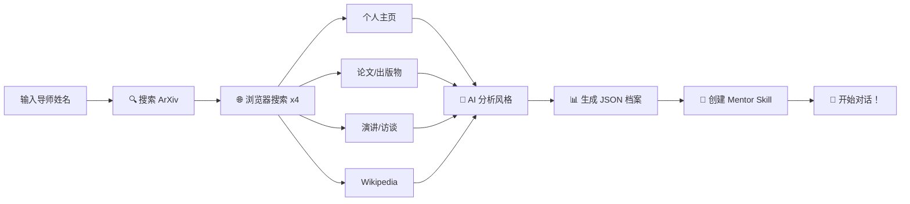

<div align="center">

# 🧪 导师.skill

### ✨ 把学术导师"蒸馏"成随时可问的 AI Skill

*A project that distills academic mentors into conversational AI skills*

[](https://opensource.org/licenses/MIT)
[](https://nodejs.org)
[](https://claude.com/claude-code)

---

</div>

## 💭 痛点太多？

### 🤔 科研工作流怕被"蒸馏"？
担心自己的研究思路被别人学走？**不如先把别人"蒸馏"了！**

### 📅 导师太忙没空交流？
- "老师，这个想法怎么样？" → **3天后才回复**
- "老师，这篇论文怎么改进？" → **下周再聊吧**
- "老师，这个方向有前景吗？" → **先去调研下**

### 😵 论文审阅没思路？
- 找不到合适的 reviewer
- 不知道从哪些角度切入
- 想要快速反馈却要等很久

### 🎯 想要即时、专业的学术指导？
**不如先来把导师蒸馏成 skill 吧！**

---

## 🚀 一键生成数字导师

```bash
# 在 Claude Code 中运行
/distill-mentor Geoffrey Hinton --affiliation "University of Toronto"

# 然后就可以随时提问了！
/geoffrey-hinton 你觉得深度学习的未来发展方向是什么？
```

**✨ 就像导师真的在身边一样！**

---

## 🎯 核心功能

| 功能 | 说明 |
|------|------|
| 🔍 **智能搜索** | **浏览器搜索**全面收集导师信息：论文、主页、演讲、访谈等 |
| 🧠 **风格分析** | AI 分析导师的研究风格、表达习惯和学术观点 |
| 💾 **持久存储** | 生成结构化 JSON 档案，随时可更新 |
| 🤖 **一键生成** | 自动创建可直接对话的 Claude Code skill |
| 🌍 **多语言** | 支持中英文导师，无障碍交流 |
| 📊 **质量评估** | 自动评估数据质量，给出改进建议 |
| ⚡ **快速模式** | 可选仅用 ArXiv + API，速度更快 |

### 🔬 全面信息收集（v1.1.0 新增）

系统现在**默认使用浏览器搜索**，从 4 个维度收集信息：

- 🎓 **个人主页和学术信息** - 机构页面、实验室网站
- 📄 **论文和出版物** - Google Scholar、ArXiv、DBLP
- 🎤 **演讲和访谈** - TED talks、YouTube、会议演讲
- 📚 **Wikipedia 和百科** - 人物传记、成就介绍

**测试结果**：成功收集 23+ 个唯一结果，数据质量评分 0.8/1.0 ✅

---

## 📖 快速开始

### 1️⃣ 安装

```bash
# 克隆仓库
git clone https://github.com/ybq22/supervisor.git
cd supervisor

# 确保 Node.js 版本 >= 18
node --version  # 应显示 v18.0.0 或更高
```

### 2️⃣ 生成你的第一个导师

```bash
# 在 Claude Code 中运行
/distill-mentor "导师姓名" --affiliation "所属机构（可选）"
```

### 3️⃣ 开始对话！

```bash
# 直接提问
/<导师姓名> 你的问题
```

---

## 🎬 实战演示

### 📝 论文审阅

```bash
/geoffrey-hinton 我这篇关于深度学习论文的创新点够不够突出？
```

**数字导师会：**
1. 总结论文核心贡献
2. 指出亮点和不足
3. 提供具体的改进建议
4. 保持导师独特的表达风格

### 🔬 研究方向咨询

```bash
/geoffrey-hinton 神经网络的架构设计有哪些前沿方向？
```

**数字导师会：**
1. 基于真实研究回答
2. 提供相关论文建议
3. 评估研究可行性
4. 明确说明不确定的地方

---

## 🏗️ 工作原理



### 浏览器搜索优势

| 特性 | 浏览器搜索（默认） | 快速模式（--no-browser） |
|------|-------------------|----------------------|
| **数据源** | 4 种（全面） | 2 种（基础） |
| **结果数** | 20-30 个 | 5-10 个 |
| **时间** | ~15-30 秒 | ~3-5 秒 |
| **质量** | ⭐⭐⭐⭐⭐ | ⭐⭐⭐ |
| **适用** | 生成高质量数字分身 | 快速测试 |

### 📂 输出文件

```
~/.claude/
├── mentors/
│   └── {导师姓名}.json          # 结构化档案
└── skills/
    └── {导师姓名}/
        └── SKILL.md             # Claude Code skill
```

---

## 📚 示例导师

| 导师 | 机构 | 研究领域 |
|------|------|----------|
| Geoffrey Hinton | University of Toronto | Deep Learning, Neural Networks, Cognitive Science |
| *[你的导师]* | *[你的机构]* | *[你的领域]* |

---

## 📖 文档

- 📖 [使用指南](docs/USAGE.md) - 详细使用说明和示例
- 🏗️ [架构设计](docs/superpowers/specs/2026-03-31-mentor-supervisor-design.md) - 系统设计文档
- ✅ [测试报告](TEST_REPORT.md) - 测试覆盖和质量保证
- 🚀 [实施记录](TEST_IMPLEMENTATION_REPORT.md) - 开发历程

---

## 🧪 开发

```bash
# 运行测试
node tests/test-distill-mentor.js

# 应该看到：
# ✅ Passed: 5/5
# 🎉 All tests passed!

# 查看测试报告
cat TEST_REPORT.md
```

---

## 🤝 贡献

欢迎贡献！你可以：

1. **添加新的数据源**（Google Scholar, DBLP 等）
2. **改进风格分析算法**
3. **优化 prompt 模板**
4. **报告 Bug 或提出建议**

---

## 📋 License

MIT License - 详见 [LICENSE](LICENSE)

---

## 🌟 Star History

如果这个项目对你有帮助，请给个 ⭐️ Star！

---

<div align="center">

**Made with ❤️ by Claude Code & Human Collaboration**

*[开始蒸馏你心中的导师吧！](https://github.com/ybq22/supervisor)*

</div>
